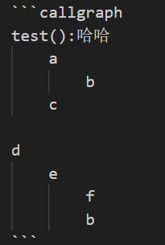
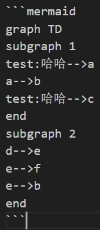
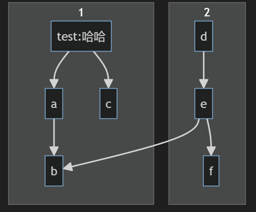

# callgraph README

This is the README for extension "callgraph". 

## Features

Convert simple code to mermaid string.

1. Use callgraph text mark like:

2. Execute `Callgraph Convert To Mermaid` command.

3. You can got this:

## Release Notes

Users appreciate release notes as you update your extension.

### 1.0.0

Initial release.

---

## For more information

* [Visual Studio Code's Markdown Support](http://code.visualstudio.com/docs/languages/markdown)
* [Markdown Syntax Reference](https://help.github.com/articles/markdown-basics/)

**Enjoy!**
